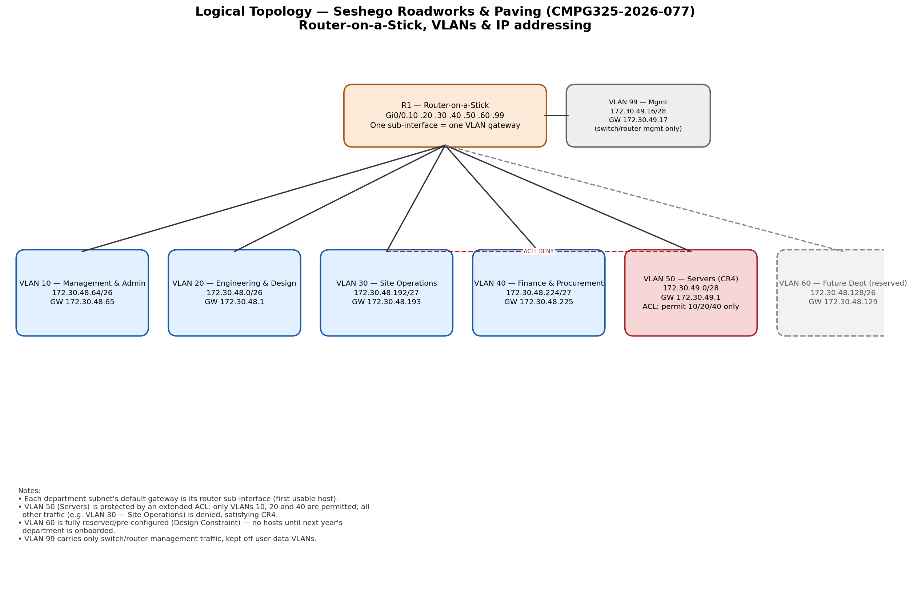

# Logical Topology

## Design summary

- **Router-on-a-Stick:** a single router interface (Gi0/0) is divided into
  seven 802.1Q sub-interfaces (Gi0/0.10, .20, .30, .40, .50, .60, .99), one
  per VLAN. Each sub-interface is the default gateway for its VLAN — this
  *is* the assigned networking challenge for this project.
- **Inter-VLAN routing:** because every department sits on its own VLAN/sub-
  interface, all inter-department traffic must pass through R1, which is
  where the ACL for CR4 is enforced.
- **Access control (CR4):** an extended ACL applied outbound on sub-interface
  Gi0/0.50 permits traffic sourced from VLAN 10, 20 and 40 to reach the
  Servers subnet, and denies everything else (explicitly demonstrated against
  VLAN 30 — Site Operations, which is unauthorised per the requirements doc).
- **Future department (Design Constraint):** VLAN 60 and its /26 already
  exist in the running configuration with no access ports assigned — bringing
  the new department online next year is a switch-port change, not a
  re-address.
- **Management plane separation:** VLAN 99 is dedicated to switch/router
  management interfaces and is not reachable from, or routed to, the user
  data VLANs by default.

## Why Router-on-a-Stick (vs. a Layer-3 switch)

A multilayer/Layer-3 switch could also do inter-VLAN routing, but the
assigned challenge is explicitly Router-on-a-Stick, and the client's device
count is modest enough (roughly 90 hosts across departments) that a single
router trunk link is not a real bottleneck — a defensible, deliberately
scoped choice for this size of client.
