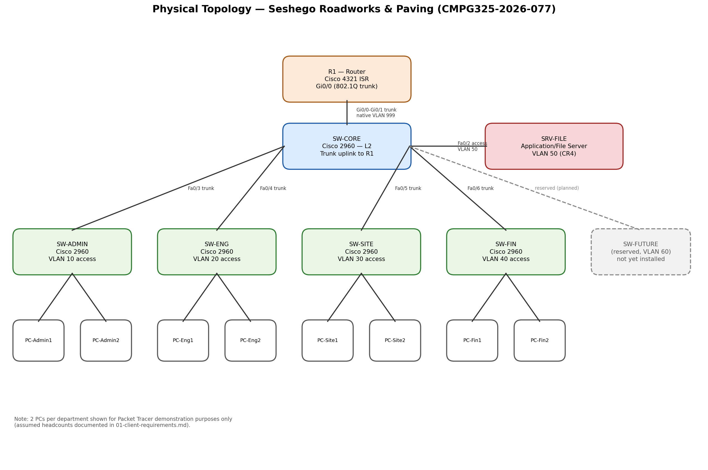

# Physical Topology

## Device list

| Device | Role | Model (Packet Tracer) | Notes |
|---|---|---|---|
| R1 | Router-on-a-Stick | Cisco 4321 ISR | Single trunk uplink to SW-CORE, 7 sub-interfaces |
| SW-CORE | L2 distribution/core switch | Cisco 2960 | Trunks to R1, each access switch, and the server |
| SW-ADMIN | Access switch | Cisco 2960 | VLAN 10 access ports |
| SW-ENG | Access switch | Cisco 2960 | VLAN 20 access ports |
| SW-SITE | Access switch | Cisco 2960 | VLAN 30 access ports |
| SW-FIN | Access switch | Cisco 2960 | VLAN 40 access ports |
| SRV-FILE | Application/file server | Generic Server | Connected directly to SW-CORE, VLAN 50 |
| SW-FUTURE | *Not yet installed* | Cisco 2960 | Reserved trunk port on SW-CORE for VLAN 60 |
| PCs | 2 per department (demo) | Generic PC | Represent each department's end users |

## Cabling

- R1 ↔ SW-CORE: trunk (802.1Q), carries all 7 VLANs, native VLAN set to an
  unused VLAN (999) as a security measure against VLAN-hopping.
- SW-CORE ↔ each access switch: trunk, but only carries that department's
  VLAN + VLAN 99 (management) — trunks are pruned to the relevant VLANs
  rather than allowing all VLANs across every link.
- SW-CORE ↔ SRV-FILE: access port, VLAN 50 only.
- Access switch ↔ PCs: access ports, one VLAN each, PortFast enabled.

## Why a two-tier design (core + access switches) rather than one switch

Mirrors how a real multi-department office is wired — each department
typically occupies its own area/floor with its own wiring closet. It also
makes the Design Constraint (new department next year) and CR4 (server
access control) easier to demonstrate cleanly on camera: each department's
traffic visibly originates from its own switch before reaching the router.
